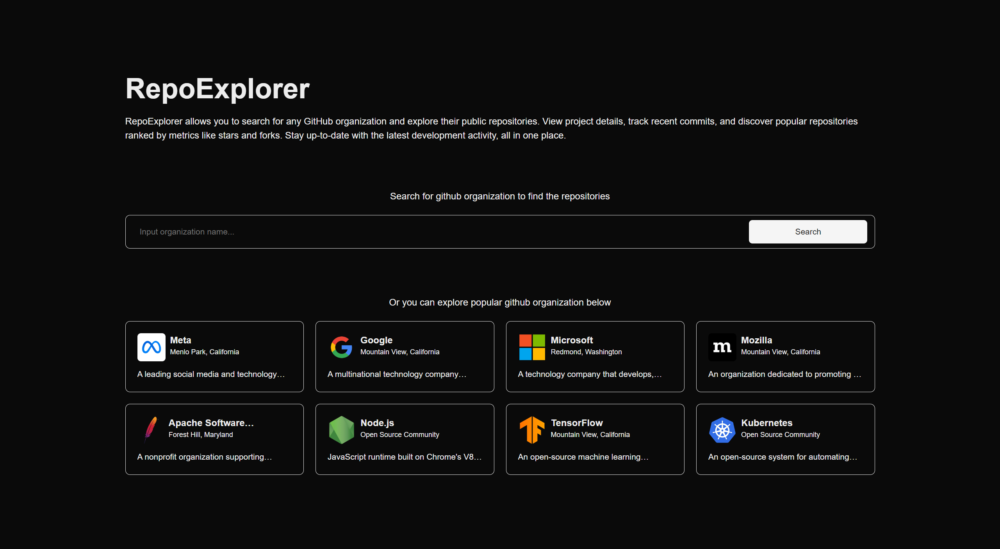

<div align="center">
  <p align="center"></p>
  <h1 style="border: none;">RepoExplorer</h1>
  <div>
    
    
    
  </div>
</div>

## 📋 <a name="table">Table of Contents</a>

1. 🤖 [Introduction](#introduction)
2. ⚙️ [Tech Stack](#tech-stack)
3. 🔋 [Features](#features)
4. 🤸 [Quick Start](#quick-start)

## <a name="introduction">🤖 Introduction</a>

RepoExplorer is a web application that allows users to explore GitHub organizations, view their profiles, and browse their public repositories. You can also inspect commits for each repository. Built with Next.js, TypeScript, and Tailwind CSS, RepoExplorer features a responsive design and includes a search function for organizations and repositories. Users can paginate through repositories and sort them by stars, forks, or last updated date. The application also implements unit testing using Jest for reliable functionality.

<br />


## <a name="tech-stack">⚙️ Tech Stack</a>

- Next.js
- TypeScript
- Jest
- Axios
- Tailwind CSS
- Shadcn
- Zod

## <a name="features">🔋 Features</a>

👉 **Core Features**:

- Responsive design with Tailwind CSS for a seamless user experience across devices.
- Search functionality to easily find organizations and repositories.
- Paginated views for repositories with sorting options (by stars, forks, or last updated).
- Detailed commit history for each repository.
- Client-side form validation and error handling.
- Unit testing using Jest to ensure code reliability.

👉 **Development Best Practices**:

- Effective handling of API routes (GET) to interact with the GitHub API.
- Proper data fetching strategies in server components.
- Component reusability and separation of concerns for maintainable code.
- Implementation of a clean and organized code structure.

## <a name="quick-start">🤸 Quick Start</a>

Follow these steps to set up the project locally on your machine.

**Prerequisites**

Make sure you have the following installed on your machine:

- [Git](https://git-scm.com/)
- [Node.js](https://nodejs.org/en)
- [npm](https://www.npmjs.com/) (Node Package Manager)

**Cloning the Repository**

```bash
git clone https://github.com/Firkhie/repo-explorer.git
cd repo-explorer
```

**Package Installation**

Install the project dependencies using npm:

```bash
npm i
```

**Set Up Environment Variables**

Create a new file named `.env` in the root of your project and add the following content:

```env
GITHUB_TOKEN=
```

Replace the placeholder values with your actual respective account credentials.
You can follow this tutorial to generate [Github-Token](https://medium.com/@mbohlip/how-to-generate-a-classic-personal-access-token-in-github-04985b5432c7)

**Testing the Project**

```bash
npm run test
```

**Running the Project**

```bash
npm run dev
```

Open [http://localhost:3000](http://localhost:3000) in your browser to view the project.

#
